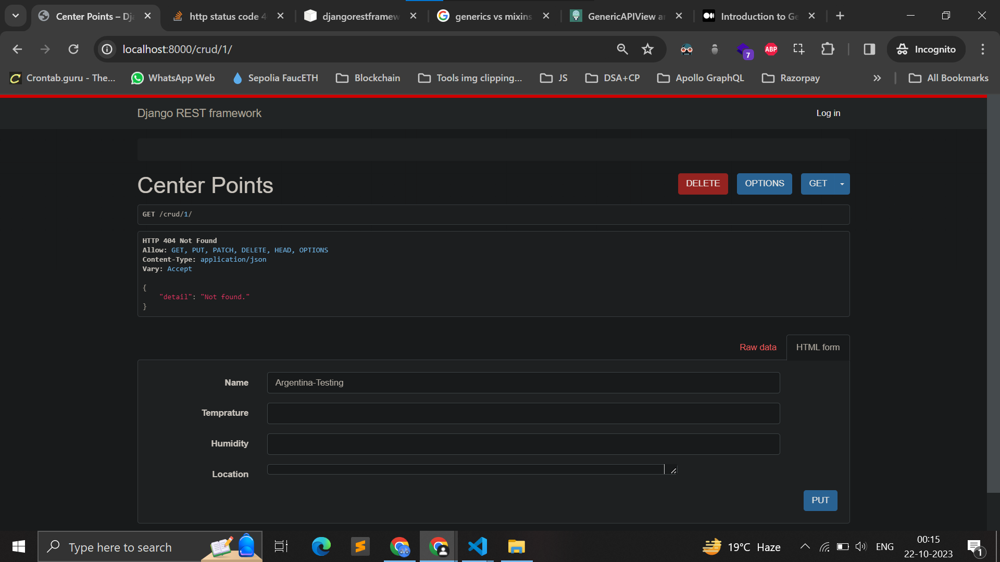
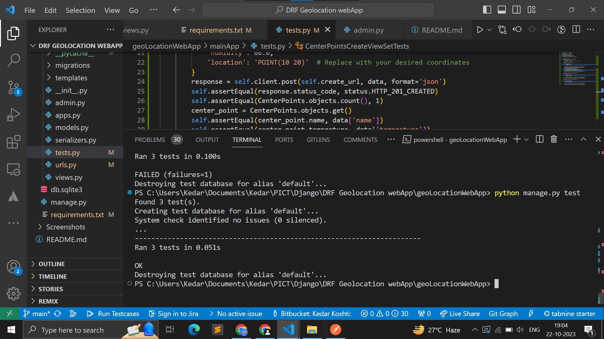

# DRF-GeoLocation
# Screenshots & GIFs (wait some time for loading 5-10 mb of gifs)





## Developer's Guide/Steps -

1. Install OSGeo4W via Installer, use administrator mode of cmd & type one line at one time
```
set OSGEO4W_ROOT=C:\OSGeo4W
set GDAL_DATA=%OSGEO4W_ROOT%\apps\gdal\share\gdal
set PROJ_LIB=%OSGEO4W_ROOT%\share\proj
set PATH=%PATH%;%OSGEO4W_ROOT%\bin
reg ADD "HKLM\SYSTEM\CurrentControlSet\Control\Session Manager\Environment" /v Path /t REG_EXPAND_SZ /f /d "%PATH%"
reg ADD "HKLM\SYSTEM\CurrentControlSet\Control\Session Manager\Environment" /v GDAL_DATA /t REG_EXPAND_SZ /f /d "%GDAL_DATA%"
reg ADD "HKLM\SYSTEM\CurrentControlSet\Control\Session Manager\Environment" /v PROJ_LIB /t REG_EXPAND_SZ /f /d "%PROJ_LIB%"
```
2. Install PostGis (which is extension of PostgreSQL) via Stack Builder Installer or via link https://download.osgeo.org/postgis/windows/ for your respective postgresql version
3. install all dependencies there in requirements.py
4. update your postgresql credentials in settings.py file
5. run django program

## SuperAdmin/superUser Info - 
adminName - admin
password - admin@1234
Email address: admin@gmail.com

## Input -
Name 
Location -> POINT(-0.2153 45.6402)
```
{
    "id": 1,
    "type": "Feature",
    "geometry": {
        "type": "Point",
        "coordinates": [
            37.7749,
            -122.4194
        ]
    },
    "properties": {
        "name": "ArgentinaTesting",
        "temprature": 55.0,
        "humidity": 27.0
    }
}

Location - Point(37.7749 -122.4194)
```

## Problem-Statement/Objective:

0. Create a Python / GeoDjango / PostGIS / DRF (Django rest framework) website with Git-based source control with the ability to:

1. Store geolocations in an appropriate database model eg: PointField() ; ;

2. Retrieve National Weather Service current weather data (Temperature and humidity specifically) for the locations (https://www.weather.gov/documentation/services-web-api) ;

3. Present them as a Leaflet map on a view. https://leafletjs.com/ ;

4. Bonus: Show test coverage for the project. For each of the subtasks, we are measuring: 0) Can the candidate set up a working PostGIS / GeoDjango environment along with GitHub source control ;

5. Can the candidate produce an appropriate database model, do they understand how the Django ORM works? ;

6. Can they use a library like "requests" to communicate with an external API

7. Can they create a View in Django, and use Leaflet (a Javascript library and a Django plugin) to show the location pins on a map ;

8. Do they understand Test-Driven Development.

9. Add Points (Latitude-Longitude) to the database using Django Rest Framework and use this data to fetch Weather API
   - Post API endpoints for Storing data in the database
   - Update API endpoints to Update data in the database
   - Delete API endpoints to Delete data from the database

## Hints:

1. https://docs.djangoproject.com/en/3.0/ref/contrib/gis/tutorial/

2. https://django-leaflet.readthedocs.io/en/latest/

3. https://docs.djangoproject.com/en/3.0/topics/testing/advanced/#integration-with-coverage-py

You should share your completed project as a repo on GitHub on mentioned date. Looking forward to your solution.
